# anki-persistence [](https://app.travis-ci.com/github/SimonLammer/anki-persistence)
Persist data between both sides of an anki flashcard.

While the following example explicitly shows the random number, it could instead be used internally to do many different things:

* Choose one of several pictures (at random) *- Maybe someone wants to learn the names of instruments from a picture depicting it; One of multiple views of the instrument could be shown, a different one in every review.*
* Reorder elements in the card *- Shuffle the answers of a multiple choice question.*
* ...

It could also be used completely different as well. To let the user input something on the frontside and use that same input on the backside for example.

## Example: Random number

This example shows how anki-persistence can be used to display the same random number on both sides of an Anki flash card. **All of these images depict the same card!** You can try it out yourself with [this exported Anki deck](examples/random-number/anki-persistence.apkg).

### Result
| Client  | Front | Back |
| -------:|:-----:|:----:|
|     Web | 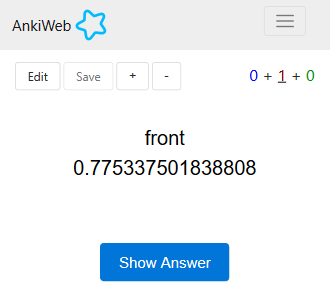 | 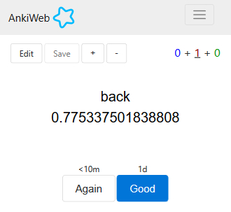 |
| Android | 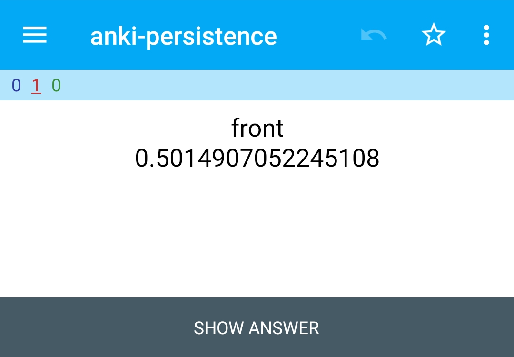 | 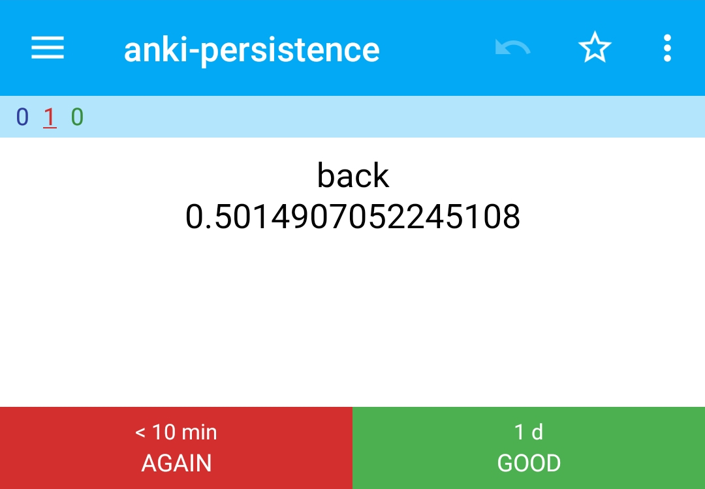 |
| Android (card preview) | 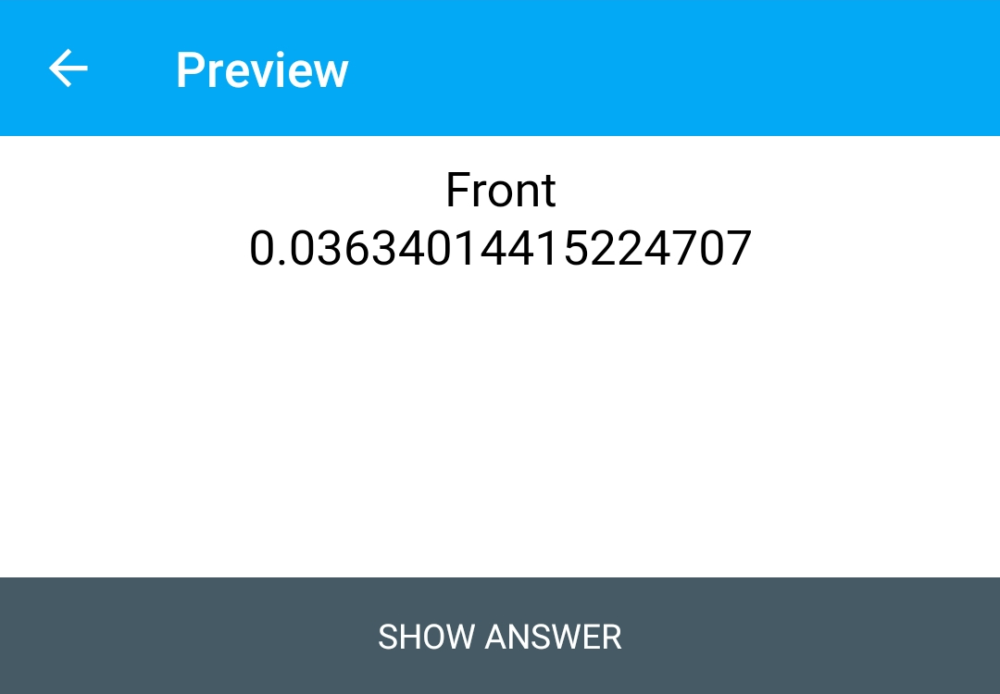 |  |
|     iOS | 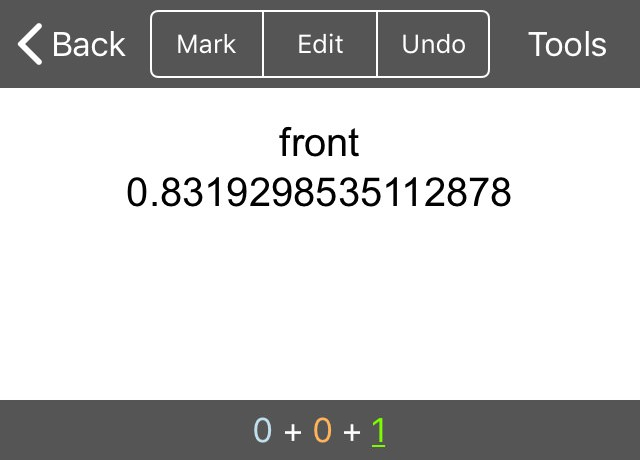 | 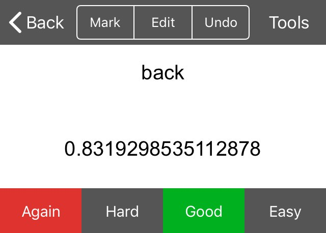 |
|     iOS (card preview) |  | 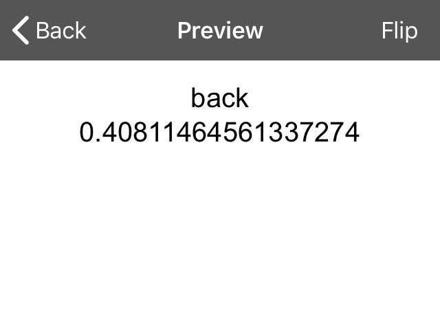 |
|     Mac | 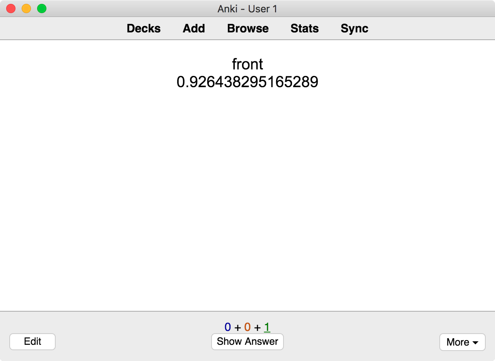 | 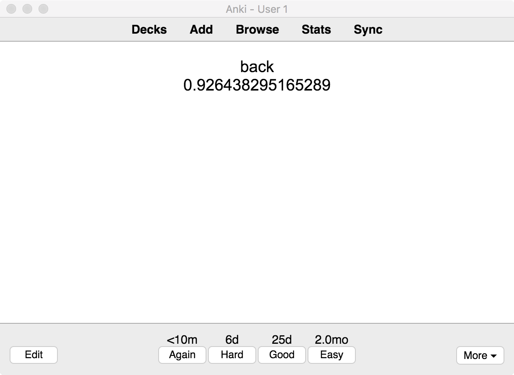 |
|     Mac (card preview) | 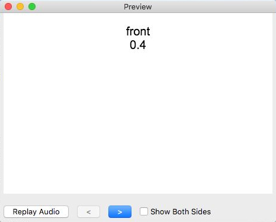 | 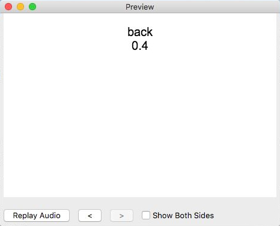 |
|     Mac (card type editor preview) | 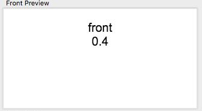 | 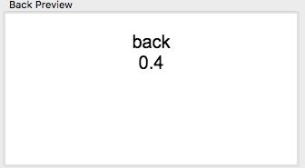 |
| Windows | 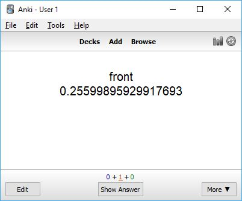 | 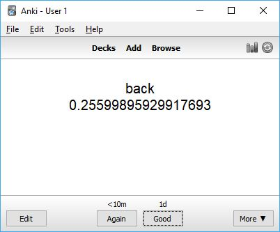 |
| Windows (card preview) | 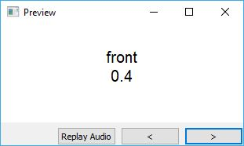 | 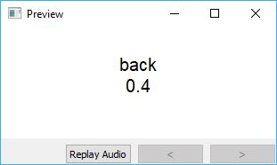 |
| Windows (card type editor preview) |  |  |
|   Linux | 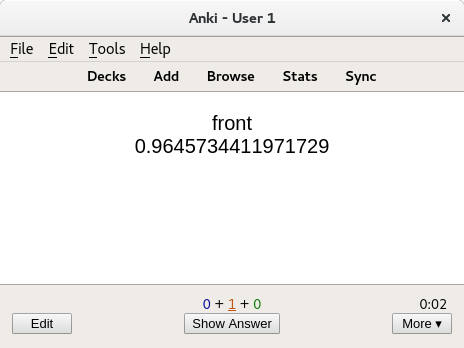 | 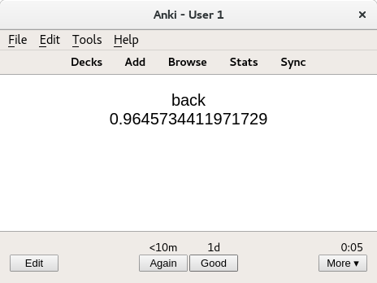 |
|   Linux (card preview) | 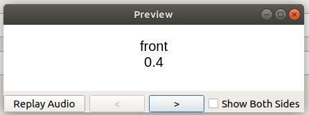 | 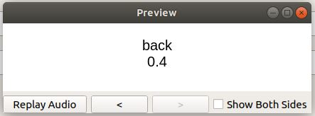 |
|   Linux (card type editor preview) | 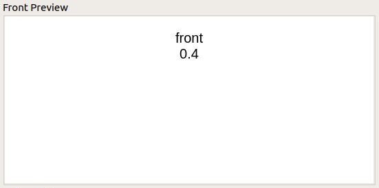 | 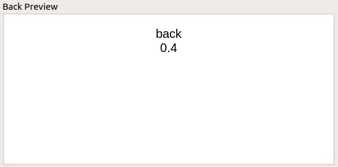 |

#### Why is 0.4 chosen so often?

The most powerful feature of this project is that you can check availability of persistence on the front side - there should never be a case where ```Persistence.isAvailable()``` returns ```true``` on the front- and ```false``` on the backside *(if there is, [please create a bug report](https://github.com/SimonLammer/anki-persistence/issues/new?template=bug_report.md), so it can be fixed as soon as possible)*.

The shown example chooses 0.4 as default value - to be overwritten if ```Persistence.isAvailable``` returns ```true``` (which is not the case for desktop client previews). Therefore the card will only use the random number when it is sure that it can be persisted to the back side, and default to 0.4 otherwise.

### Setup
#### Front side
~~~html
<script>
// 1.0.1 - https://github.com/SimonLammer/anki-persistence/blob/0afc84628df06d06fb1daf31579891196e6b2005/script.js
if(void 0===window.Persistence){var e="github.com/SimonLammer/anki-persistence/",t="_default";if(window.Persistence_sessionStorage=function(){var i=!1;try{"object"==typeof window.sessionStorage&&(i=!0,this.clear=function(){for(var t=0;t<sessionStorage.length;t++){var i=sessionStorage.key(t);0==i.indexOf(e)&&(sessionStorage.removeItem(i),t--)}},this.setItem=function(i,n){void 0==n&&(n=i,i=t),sessionStorage.setItem(e+i,JSON.stringify(n))},this.getItem=function(i){return void 0==i&&(i=t),JSON.parse(sessionStorage.getItem(e+i))},this.removeItem=function(i){void 0==i&&(i=t),sessionStorage.removeItem(e+i)},this.getAllKeys=function(){for(var t=[],i=Object.keys(sessionStorage),n=0;n<i.length;n++){var s=i[n];0==s.indexOf(e)&&t.push(s.substring(e.length,s.length))}return t.sort()})}catch(n){}this.isAvailable=function(){return i}},window.Persistence_windowKey=function(i){var n=window[i],s=!1;"object"==typeof n&&(s=!0,this.clear=function(){n[e]={}},this.setItem=function(i,s){void 0==s&&(s=i,i=t),n[e][i]=s},this.getItem=function(i){return void 0==i&&(i=t),void 0==n[e][i]?null:n[e][i]},this.removeItem=function(i){void 0==i&&(i=t),delete n[e][i]},this.getAllKeys=function(){return Object.keys(n[e])},void 0==n[e]&&this.clear()),this.isAvailable=function(){return s}},window.Persistence=new Persistence_sessionStorage,Persistence.isAvailable()||(window.Persistence=new Persistence_windowKey("py")),!Persistence.isAvailable()){var i=window.location.toString().indexOf("title"),n=window.location.toString().indexOf("main",i);i>0&&n>0&&n-i<10&&(window.Persistence=new Persistence_windowKey("qt"))}}
</script>

{{Front}}

<div id="front"></div>

<script>
var number = 0.4;                 // Default to 0.4.
if (Persistence.isAvailable()) {  // Check whether Persistence works on the client.
  number = Persistence.getItem(); // Retrieve a previously stored number and override the default. (In case this is executed on the backside as well by {{FrontSide}})
  if (number == null) {           // If there was no number stored previously:
    number = Math.random();       //   1. Create a random number and override the default.
    Persistence.setItem(number);  //   2. Store that number
  }
}
window.front.appendChild(document.createTextNode(number)); // Print the number.
</script>
~~~

#### Back side

~~~html
<script>
// 1.0.1 - https://github.com/SimonLammer/anki-persistence/blob/0afc84628df06d06fb1daf31579891196e6b2005/script.js
if(void 0===window.Persistence){var e="github.com/SimonLammer/anki-persistence/",t="_default";if(window.Persistence_sessionStorage=function(){var i=!1;try{"object"==typeof window.sessionStorage&&(i=!0,this.clear=function(){for(var t=0;t<sessionStorage.length;t++){var i=sessionStorage.key(t);0==i.indexOf(e)&&(sessionStorage.removeItem(i),t--)}},this.setItem=function(i,n){void 0==n&&(n=i,i=t),sessionStorage.setItem(e+i,JSON.stringify(n))},this.getItem=function(i){return void 0==i&&(i=t),JSON.parse(sessionStorage.getItem(e+i))},this.removeItem=function(i){void 0==i&&(i=t),sessionStorage.removeItem(e+i)},this.getAllKeys=function(){for(var t=[],i=Object.keys(sessionStorage),n=0;n<i.length;n++){var s=i[n];0==s.indexOf(e)&&t.push(s.substring(e.length,s.length))}return t.sort()})}catch(n){}this.isAvailable=function(){return i}},window.Persistence_windowKey=function(i){var n=window[i],s=!1;"object"==typeof n&&(s=!0,this.clear=function(){n[e]={}},this.setItem=function(i,s){void 0==s&&(s=i,i=t),n[e][i]=s},this.getItem=function(i){return void 0==i&&(i=t),void 0==n[e][i]?null:n[e][i]},this.removeItem=function(i){void 0==i&&(i=t),delete n[e][i]},this.getAllKeys=function(){return Object.keys(n[e])},void 0==n[e]&&this.clear()),this.isAvailable=function(){return s}},window.Persistence=new Persistence_sessionStorage,Persistence.isAvailable()||(window.Persistence=new Persistence_windowKey("py")),!Persistence.isAvailable()){var i=window.location.toString().indexOf("title"),n=window.location.toString().indexOf("main",i);i>0&&n>0&&n-i<10&&(window.Persistence=new Persistence_windowKey("qt"))}}
</script>

{{Back}}

<div id="back"></div>

<script>
var number = 0.4;                 // Default to 0.4.
if (Persistence.isAvailable()) {  // Check whether Persistence works on the client.
  number = Persistence.getItem(); // Retrieve the previously stored number and override the default.
  Persistence.clear();            // Clear the storage, so a new random number will be created on the next card.
}
window.back.appendChild(document.createTextNode(number)); // Print the number.
</script>
~~~

#### Note

The note has two fields: ```Front``` and ```Back```.
These are set to ```front``` and ```back``` respectively.

## Preparation

To use anki-persistense, follow these steps:
1. Download the script from [the latest release](https://github.com/SimonLammer/anki-persistence/releases/tag/v1.0.0). Using the minified version (```minified.js```) is recommended, in order to save space in the anki card type. (A link to the non-minified version is always added to the file, in case someone wants to look at the human-readable code.)
1. Copy and paste the file contents between to the beginning of front and back side of the card type.
1. Ensure that both script blocks are enclosed in ```<script>``` and ```</script>```.

*This can be seen in [the example setup](#setup).*

## Usage

Anki clients vary in their implementation and JavaScript can behave differently in each one. Therefore, check for availability before using other Persistence methods.

~~~javascript
if (Persistence.isAvailable()) {
	// do stuff
}
~~~

Other methods:

|                       Name    | Description                                                                                                |
| -----------------------------:|:-----------------------------------------------------------------------------------------------------------|
|            ```Persistence.clear()``` | Removes all previously persisted key-value pairs.                                                          |
|       ```Persistence.getItem(key)``` | Retrieves the value associated with the key. If no value is associated to the given key, null is returned. |
|         ```Persistence.getItem()``` | Retrieves the value associated with a default key.                                                         |
| ```Persistence.setItem(key, value)``` | Persists the key-value pair.                                                                               |
|      ```Persistence.setItem(value)``` | Persists the value using a default key.                                                                    |
|    ```Persistence.removeItem(key)``` | Removes the value associated with the key. If no value is associated to the given key, nothing happens.    |
|       ```Persistence.removeItem()``` | Removes the value associated with a default key.                                                           |
|       ```Persistence.getAllKeys()``` | Retrieves all keys in storage.                                                                             |


`key` may be any string.

*Some implementations of Persistence may use JSON.stringify and JSON.parse in the process of persisting and retrieving data. If you plan on persisting a custom object, make sure that ```obj``` equals ```JSON.parse(JSON.stringify(obj))```.*

### Clear storage

```Persistence.setItem``` may persist data across cards, this should be stopped by calling ```Persistence.clear()``` at the end of the backside. (If this gets called on the frontside's beginning instead, you cannot use anki's ```{{FrontSide}}``` special field in the backside *- because doing so would delete the persisted data*)

## How it works

There are two separate internal implementations of Persistence: ```Persistence_sessionStorage``` and ```Persistence_windowKey```. The former uses [the sessionStorage property](https://developer.mozilla.org/en-US/docs/Web/API/Window/sessionStorage), while the latter attaches a new property to an existing persistent *(not changing between front- and backside of an anki flashcard)* property of the window object and uses that attached property to persist and retrieve data.

Anki's android client has no persistent window properties, so the internal implementation of choice is obviously ```Persistence_sessionStorage```. The desktop clients don't permit the ```sessionStorage``` property, so ```Persistence_windowKey``` is used.

Additional thought is required for linux and mac 2.1 clients. The window property, which is persistent in review mode, is present - but not persistent - in the preview modes. ```window.location``` helps us circumvent this issue, as it contains html, which only specifies `title` as ```main webview``` in review mode.

# Acknowledgements

Huge thanks to

* [RunasSudo, whose code kick-started this project](https://yingtongli.me/blog/2015/03/15/random-question-generator-on-anki-using.html)!
* [u/CheCheDaWaff for providing test information and screenshots of the woking random number example on **mac** and **iOS** clients](https://www.reddit.com/r/Anki/comments/8ksjqb/pass_data_between_both_sides_of_an_anki_flashcard/dzbpfdd/)
* [u/qwiglydee for providing test information and screenshots of the working random number example on the **linux** client](https://www.reddit.com/r/Anki/comments/8ksjqb/pass_data_between_both_sides_of_an_anki_flashcard/dzbpnbm/)

## Anki projects utilizing anki-persistence

* [Set Randomizer by hgiesel](https://github.com/hgiesel/anki-set-randomizer), also on [AnkiWeb](https://ankiweb.net/shared/info/1164532380)
* [Anki awesome select](https://github.com/git9527/anki-awesome-select)

## Other references

* [r/Anki - Passings state between Fields](https://www.reddit.com/r/Anki/comments/4mhfmm/passing_state_between_fields/)
* [r/Anki - Pass data between both sides of an Anki flashcard](https://www.reddit.com/r/Anki/comments/8ksjqb/pass_data_between_both_sides_of_an_anki_flashcard/)
