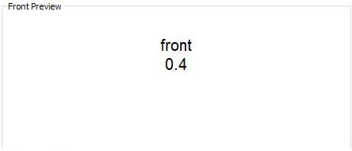

# anki-persistence
Persist data between both sides of an anki flashcard.

While the following example explicitly shows the random number, it could instead be used internally to do many different things:

* choose one of several pictures (at random) *- Maybe someone wants to learn the names of instruments from a picture depicting it; One of multiple views of the instrument could be shown, a different one in every review.*
* reorder elements in the card *- Shuffle the answers of a multiple choice question.*
* ...

It could also be used completely different as well. To let the user input something on the frontside and use that same input on the backside for example.

## Example: Random number

This example shows how anki-persistence can be used to display the same random number on both sides of an Anki flash card. **All of these images depict the same note!** You can try it out yourself with [this exported Anki deck](examples/random-number/anki-persistence.apkg).

### Result
| Client  | Front | Back |
| -------:|:-----:|:----:|
|     Web |  |  |
| Android |  |  |
| Android (card preview) |  |  |
|     iOS |  |  |
|     iOS (card preview) |  |  |
|     Mac |  |  |
|     Mac (card preview) |  |  |
|     Mac (card type editor preview) |  |  |
| Windows |  |  |
| Windows (card preview) |  |  |
| Windows (card type editor preview) |  |  |
|   Linux |  |  |
|   Linux (card preview) |  |  |
|   Linux (card type editor preview) |  |  |

**Note that Persistence is not available for desktop client previews (```Persistence.isAvailable()``` returns ```false```), thus a default (0.4) is chosen.**

### Setup
#### Front side
~~~html
<script>
// v0.5.0 - https://github.com/SimonLammer/anki-persistence/blob/6ee3446a97f24e037c14642d6aa608ccbc6f3169/script.js
if(void 0===window.Persistence){var _persistenceKey="github.com/SimonLammer/anki-persistence/",_defaultKey="_default";if(window.Persistence_sessionStorage=function(){var e=!1;try{"object"==typeof window.sessionStorage&&(e=!0,this.clear=function(){for(var e=0;e<sessionStorage.length;e++){var t=sessionStorage.key(e);0==t.indexOf(_persistenceKey)&&(sessionStorage.removeItem(t),e--)}},this.setItem=function(e,t){void 0==t&&(t=e,e=_defaultKey),sessionStorage.setItem(_persistenceKey+e,JSON.stringify(t))},this.getItem=function(e){return void 0==e&&(e=_defaultKey),JSON.parse(sessionStorage.getItem(_persistenceKey+e))},this.removeItem=function(e){void 0==e&&(e=_defaultKey),sessionStorage.removeItem(_persistenceKey+e)})}catch(e){}this.isAvailable=function(){return e}},window.Persistence_windowKey=function(e){var t=window[e],i=!1;"object"==typeof t&&(i=!0,this.clear=function(){t[_persistenceKey]={}},this.setItem=function(e,i){void 0==i&&(i=e,e=_defaultKey),t[_persistenceKey][e]=i},this.getItem=function(e){return void 0==e&&(e=_defaultKey),t[_persistenceKey][e]||null},this.removeItem=function(e){void 0==e&&(e=_defaultKey),delete t[_persistenceKey][e]},void 0==t[_persistenceKey]&&this.clear()),this.isAvailable=function(){return i}},window.Persistence=new Persistence_sessionStorage,Persistence.isAvailable()||(window.Persistence=new Persistence_windowKey("py")),!Persistence.isAvailable()){var titleStartIndex=window.location.toString().indexOf("title"),titleContentIndex=window.location.toString().indexOf("main",titleStartIndex);titleStartIndex>0&&titleContentIndex>0&&titleContentIndex-titleStartIndex<10&&(window.Persistence=new Persistence_windowKey("qt"))}}
</script>

{{Front}}

<div id="front"></div>

<script>
var number = 0.4;                 // Default to 0.4.
if (Persistence.isAvailable()) {  // Check whether Persistence works on the client.
  number = Persistence.getItem(); // Retrieve a previously stored number and override the default. (In case this is executed on the backside as well by {{FrontSide}})
  if (number == null) {           // If there was no number stored previously:
    number = Math.random();       //   1. Create a random number and override the default.
    Persistence.setItem(number);  //   2. Store that number
  }
}
window.front.appendChild(document.createTextNode(number)); // Print the number.
</script>
~~~

#### Back side

~~~html
<script>
// v0.5.0 - https://github.com/SimonLammer/anki-persistence/blob/6ee3446a97f24e037c14642d6aa608ccbc6f3169/script.js
if(void 0===window.Persistence){var _persistenceKey="github.com/SimonLammer/anki-persistence/",_defaultKey="_default";if(window.Persistence_sessionStorage=function(){var e=!1;try{"object"==typeof window.sessionStorage&&(e=!0,this.clear=function(){for(var e=0;e<sessionStorage.length;e++){var t=sessionStorage.key(e);0==t.indexOf(_persistenceKey)&&(sessionStorage.removeItem(t),e--)}},this.setItem=function(e,t){void 0==t&&(t=e,e=_defaultKey),sessionStorage.setItem(_persistenceKey+e,JSON.stringify(t))},this.getItem=function(e){return void 0==e&&(e=_defaultKey),JSON.parse(sessionStorage.getItem(_persistenceKey+e))},this.removeItem=function(e){void 0==e&&(e=_defaultKey),sessionStorage.removeItem(_persistenceKey+e)})}catch(e){}this.isAvailable=function(){return e}},window.Persistence_windowKey=function(e){var t=window[e],i=!1;"object"==typeof t&&(i=!0,this.clear=function(){t[_persistenceKey]={}},this.setItem=function(e,i){void 0==i&&(i=e,e=_defaultKey),t[_persistenceKey][e]=i},this.getItem=function(e){return void 0==e&&(e=_defaultKey),t[_persistenceKey][e]||null},this.removeItem=function(e){void 0==e&&(e=_defaultKey),delete t[_persistenceKey][e]},void 0==t[_persistenceKey]&&this.clear()),this.isAvailable=function(){return i}},window.Persistence=new Persistence_sessionStorage,Persistence.isAvailable()||(window.Persistence=new Persistence_windowKey("py")),!Persistence.isAvailable()){var titleStartIndex=window.location.toString().indexOf("title"),titleContentIndex=window.location.toString().indexOf("main",titleStartIndex);titleStartIndex>0&&titleContentIndex>0&&titleContentIndex-titleStartIndex<10&&(window.Persistence=new Persistence_windowKey("qt"))}}
</script>

{{Back}}

<div id="back"></dv>

<script>
var number = 0.4;                 // Default to 0.4.
if (Persistence.isAvailable()) {  // Check whether Persistence works on the client.
  number = Persistence.getItem(); // Retrieve the previously stored number and override the default.
  Persistence.clear();            // Clear the storage, so a new random number will be created on the next card.
}
window.back.appendChild(document.createTextNode(number)); // Print the number.
</script>
~~~

#### Note

The note has two fields: ```Front``` and ```Back```.
These are set to ```front``` and ```back``` respectively.

## Preparation

To use anki-persistense, follow these steps:
1. Download the script from [the latest release](releases/latest). We recommend using the minified version (```minified.js```) to save space in the anki card type.
1. Copy and paste the file contents between to the beginning of front and back side of the card type.
1. Ensure that both script blocks are enclosed in ```<script>``` and ```</script>```.

*This can be seen in [the example setup](#setup).*

## Usage

Anki clients vary in their implementation and JavaScript can behave differently in each one. Therefore, check for availability before using other Persistence methods.

~~~javascript
if (Persistence.isAvailable()) {
	// do stuff
}
~~~

Other methods:

|                       Name    | Description |
| -----------------------------:|:----------- |
|            ```Persistence.clear()``` | Removes all previously persisted key-value pairs. |
|       ```Persistence.getItem(key)``` | Retrieves the data associated with the key. If no data is associated to the given key, null is returned. |
|         ```Persistence.getItem())``` | Retrieves the data associated with a default key. |
| ```Persistence.setItem(key, data)``` | Persists the key-value pair. |
|      ```Persistence.setItem(data)``` | Persists the value using a default key. |
|    ```Persistence.removeItem(key)``` | Removes the data associated with the key. If no data is associated to the given key, nothing happens. |
|       ```Persistence.removeItem()``` | Removes the data associated with a default key. |

*Some implementations of Persistence may use JSON.stringify and JSON.parse in the process of persisting and retrieving data.*

### Clear storage

```Persistence.setItem``` may persist data across cards, this should be stopped by calling ```Persistence.clear()``` at the end of the backside. (If this gets called on the frontside's beginning instead, you cannot use anki's ```{{FrontSide}}``` special field in the backside *- because this would delete the persisted data*)

## How it works

There are two separate internal implementations of Persistence: ```Persistence_sessionStorage``` and ```Persistence_windowKey```. The former uses [the sessionStorage property](https://developer.mozilla.org/en-US/docs/Web/API/Window/sessionStorage), while the latter attaches a new property to an existing persistent *(not changing between front- and backside of an anki flashcard)* property of the window object and uses that attached property to persist and retrieve data.

Anki's android client has no persistent window properties, so the internal implementation of choice is obviously ```Persistence_sessionStorage```. The desktop clients don't permit the ```sessionStorage``` property, so ```Persistence_windowKey``` is used.

Additional thought is required for linux and mac 2.1 clients. The window property, which is persistent in review mode, is present - but not persistent - in the preview modes. ```window.location``` helps us circumvent this issue, as it contains html, which only specifies title as ```main webview``` in review mode.

# Acknowledgements

Huge thanks to

* [RunasSudo, whose code kick-started this project](https://yingtongli.me/blog/2015/03/15/random-question-generator-on-anki-using.html)!
* [u/CheCheDaWaff for providing test information and screenshots of the woking random number example on **mac** and **iOS** clients](https://www.reddit.com/r/Anki/comments/8ksjqb/pass_data_between_both_sides_of_an_anki_flashcard/dzbpfdd/)
* [u/qwiglydee for providing test information and screenshots of the working random number example on the **linux** client](https://www.reddit.com/r/Anki/comments/8ksjqb/pass_data_between_both_sides_of_an_anki_flashcard/dzbpnbm/)


## Other references

* [r/Anki - Passings state between Fields](https://www.reddit.com/r/Anki/comments/4mhfmm/passing_state_between_fields/)
* [r/Anki - Pass data between both sides of an Anki flashcard](https://www.reddit.com/r/Anki/comments/8ksjqb/pass_data_between_both_sides_of_an_anki_flashcard/)